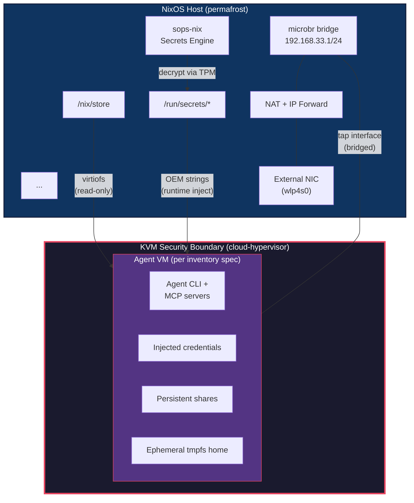
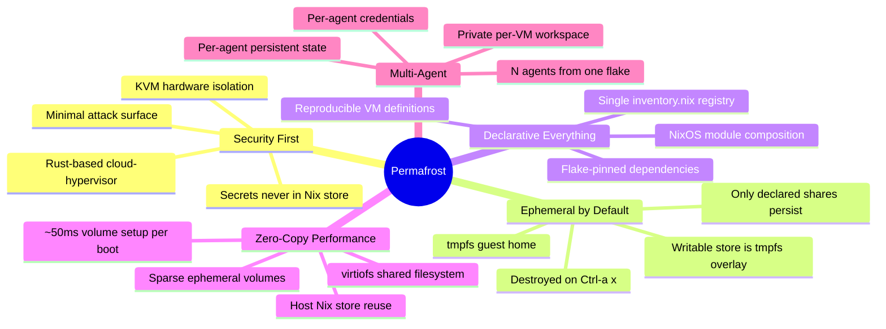
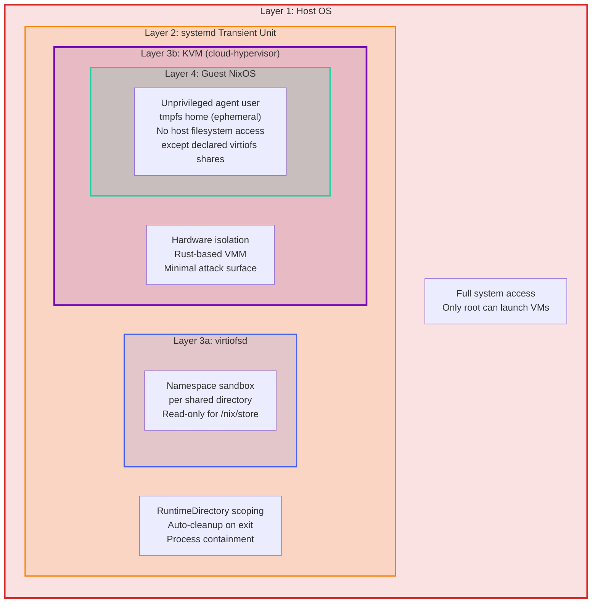
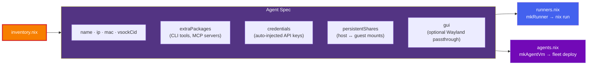
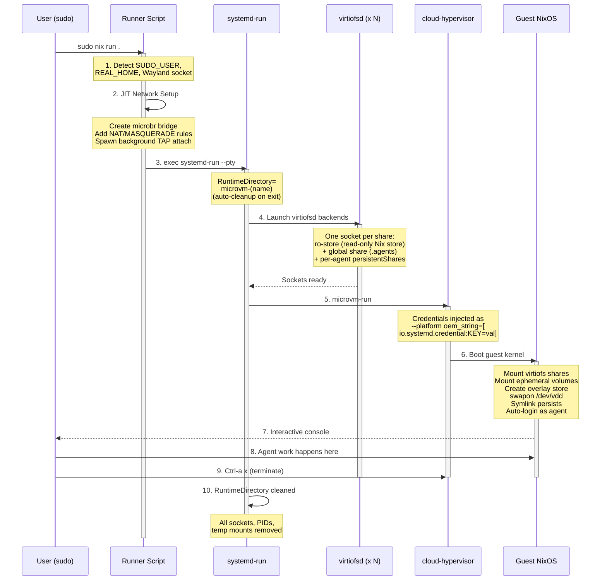
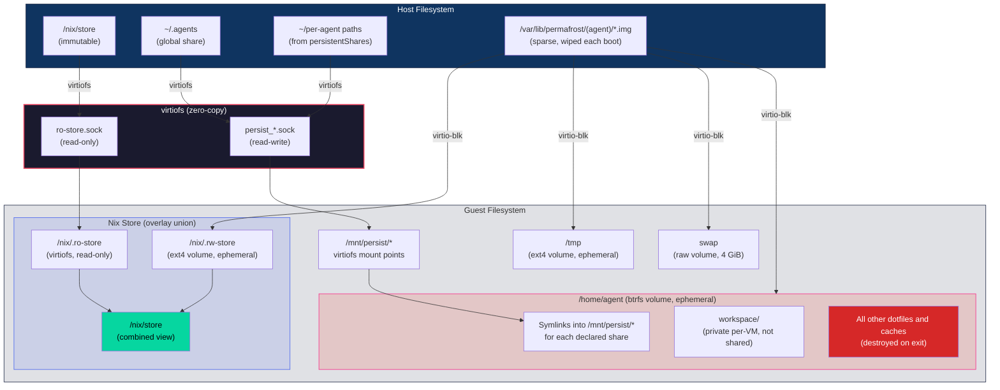

# Project Permafrost: Isolated Agent Sandbox Architecture

Permafrost is a declarative, hardware-isolated sandbox framework for executing LLM agents on NixOS. By utilizing **cloud-hypervisor** via `microvm.nix`, Permafrost enforces a rigorous KVM security boundary, ensuring that autonomous agents—which may execute arbitrary code or shell commands—remain strictly confined.

### Autonomous Workflows: Builder-Verifier (BV)

Beyond simple sandboxing, Permafrost implements the **Builder-Verifier** architecture—a dual-agent system where a creative Builder agent (Gemini) implements code while a specialized Verifier agent (Qwen) audits the session log to validate atomic claims before any human review.



---

## Quick Start

### Prerequisites
* **NixOS** host with KVM enabled.
* Flakes and `nix-command` enabled.
* A configured `microbr` bridge for NAT (see [Reference](docs/reference.md)).

### Launching an Agent
Due to the use of high-performance `tap` networking, root privileges are required to configure the host-side interfaces:

```bash
# Execute remotely:
sudo nix run github:tenarches/nix-permafrost#claude

# Or from a local clone:
sudo nix run .#claude
```

---

## Design Principles



---

## Security Model

Permafrost's security rests on nested isolation layers. Each layer restricts what the one inside it can access.



---

## Agent Spec Schema

Every agent is a declarative spec in `modules/inventory.nix`. The same spec drives both standalone runner scripts (`nix run`) and host-managed fleet deployment. To see all available agents, run `nix flake show`.



---

## What Happens When You Launch an Agent



---

## Filesystem Architecture

The guest assembles its filesystem from three sources: the host's Nix store as a read-only
virtiofs lowerdir, explicitly declared virtiofs shares that persist, and per-VM disk images
that are destroyed and recreated on every boot.

Every writable path lives on one of those ephemeral volumes. Only `/` stays in RAM. This is
deliberate: they were previously tmpfs, which meant an 8 GiB VM held 32 GiB of unreachable
size caps and `nix run` failed with ENOSPC long before any declared limit.

| Volume | Mount | Filesystem | Size | Device |
|---|---|---|---|---|
| `rw-store.img` | `/nix/.rw-store` | ext4 | 32 GiB | `/dev/vda` |
| `home.img` | `/home/agent` | btrfs + zstd | 32 GiB | `/dev/vdb` |
| `tmp.img` | `/tmp` | ext4 | 16 GiB | `/dev/vdc` |
| `swap.img` | *(raw swap)* | — | 4 GiB | `/dev/vdd` |

Images live at `/var/lib/permafrost/<agent>/` and are sparse, so a booted VM occupies well
under 1 MiB and grows only as the agent writes. Setup costs about 50 ms per boot: `mkfs` on
a sparse image is 27–52 ms, and swap is initialised by writing only a header host-side
(`mkswap`, ~7 ms) rather than `dd`-ing 4 GiB through virtio-blk on every boot.



---

## Secret Injection Pipeline

Secrets never enter the Nix store. They flow from encrypted storage through the host and into the guest as volatile OEM strings.

```mermaid
graph LR
    subgraph ENCRYPTED["At Rest (Encrypted)"]
        YAML["secrets/agents.yaml<br/>(sops-encrypted)"]
        TPM["TPM 2.0<br/>(hardware-bound<br/>age key)"]
    end

    subgraph HOST_DECRYPT["Host Decryption (boot)"]
        PREP["systemd oneshot:<br/>sops-age-key-prep"]
        AGE_KEY["/var/lib/sops-nix/<br/>key.txt"]
        SOPS_SVC["sops-nix.service"]
        RUN_SEC["/run/secrets/*"]
    end

    subgraph LAUNCH["VM Launch (runtime)"]
        CRED_FIX["microvm-credential-fix.nix<br/>extraArgsScript"]
        OEM["--platform oem_string=[<br/>io.systemd.credential:<br/>KEY=value, ...]"]
    end

    subgraph GUEST_CONSUME["Guest Consumption"]
        KERN["Guest kernel<br/>reads OEM strings"]
        SYSTEMD["systemd mounts to<br/>/run/host/credentials/"]
        AGENT["Agent process<br/>reads credential"]
    end

    TPM -->|"decrypt"| PREP
    PREP --> AGE_KEY
    AGE_KEY --> SOPS_SVC
    YAML --> SOPS_SVC
    SOPS_SVC --> RUN_SEC
    RUN_SEC -->|"cat at launch"| CRED_FIX
    CRED_FIX --> OEM
    OEM --> KERN
    KERN --> SYSTEMD
    SYSTEMD --> AGENT

    style ENCRYPTED fill:#d62828,color:#fff,stroke-width:3px
    style HOST_DECRYPT fill:#0f3460,color:#fff
    style LAUNCH fill:#7209b7,color:#fff
    style GUEST_CONSUME fill:#06d6a0,color:#000
```



---

## Further Reading

For deeper subsystem details — flake input graphs, module composition, network topology, overlay pipelines, and GUI passthrough internals:

- **[Architecture Deep Dive](docs/architecture.md)**: Extended diagrams and subsystem internals.
- **[Usage Guide](docs/usage.md)**: Running agents, managing environments, and Wayland/GUI passthrough.
- **[Technical Reference](docs/reference.md)**: `cloud-hypervisor` constraints, `tap` networking, and systemd-credential injection.
