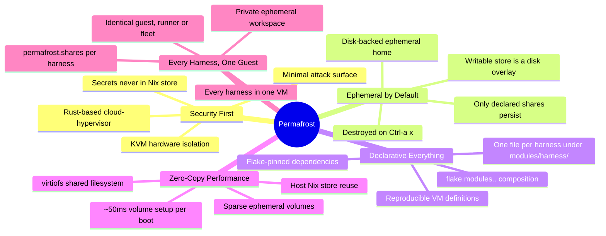
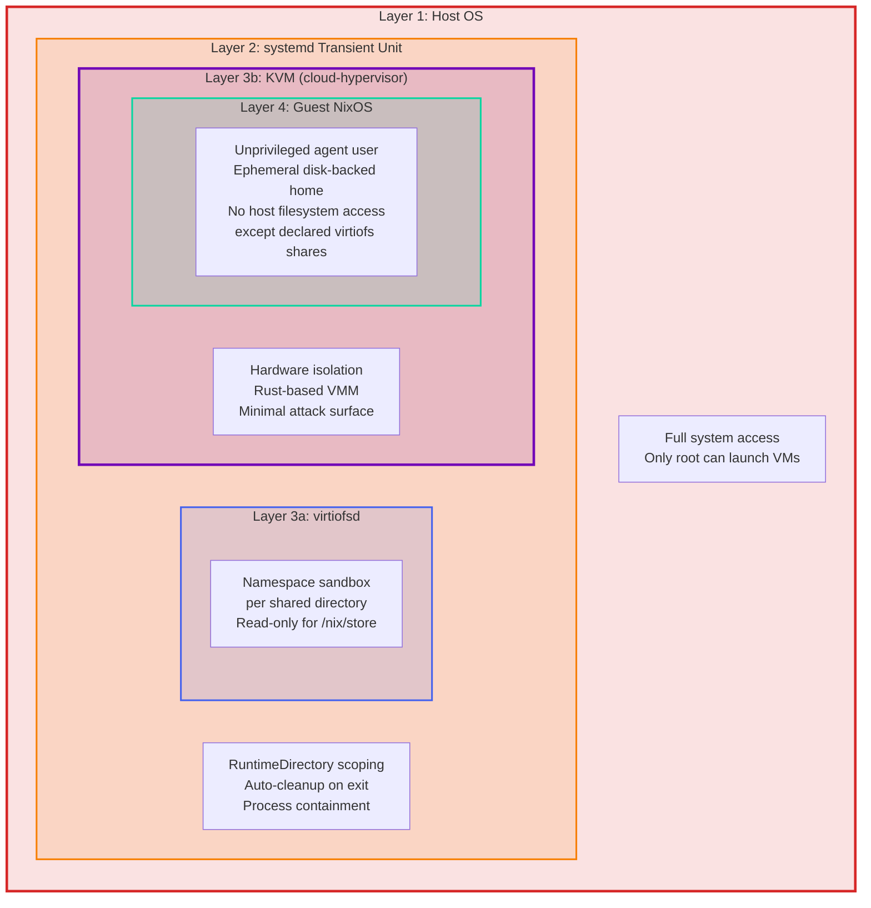
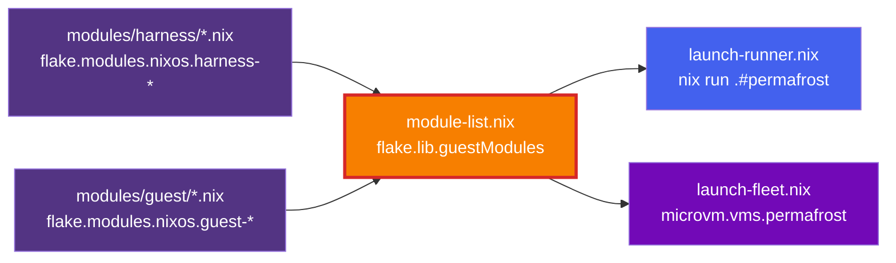
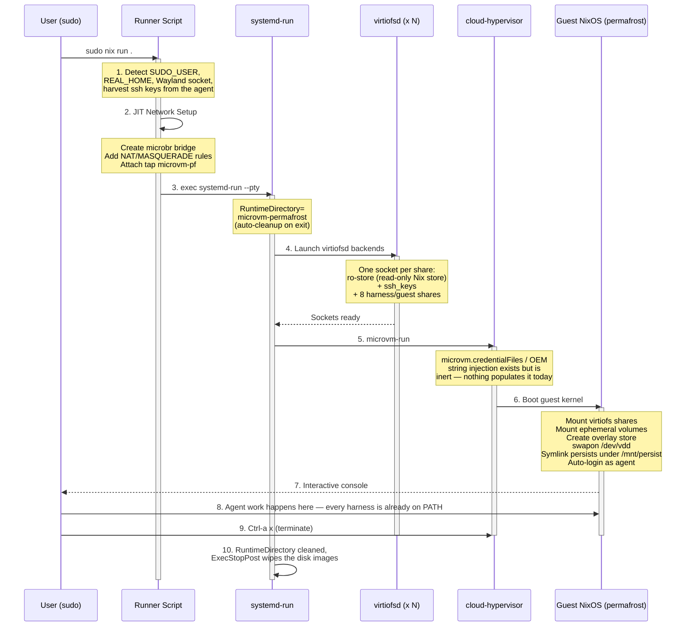
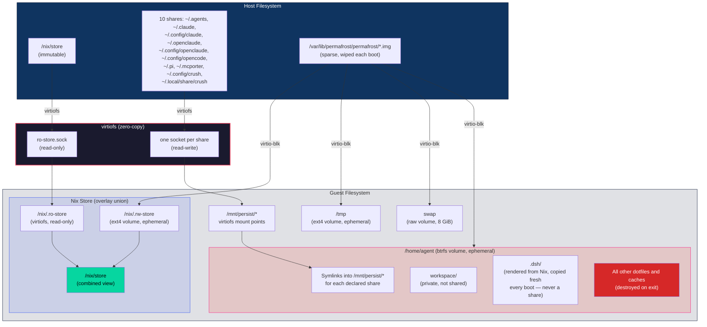

# Project Permafrost: Isolated Agent Sandbox Architecture

Permafrost is a declarative, hardware-isolated sandbox for running LLM coding agents on
NixOS. By using **cloud-hypervisor** via `microvm.nix`, Permafrost enforces a KVM security
boundary, so an agent that may execute arbitrary code or shell commands stays confined to a
disposable virtual machine.

The whole fleet is one guest, `permafrost`, carrying every harness at once: Claude Code,
openclaude, opencode, pi (plus mcporter), crush, dsh, antigravity-cli, five MCP
servers, and Playwright. There is one runner, one address, one ssh alias — see
[Harness Modules](#harness-modules) for why adding a new agent means adding one file.

---

## Quick Start

### Prerequisites
* **NixOS** host with KVM enabled.
* Flakes and `nix-command` enabled.
* A configured `microbr` bridge for NAT (see [Reference](docs/reference.md)).

### Launching an Agent
Due to the use of high-performance `tap` networking, root privileges are required to configure the host-side interfaces:

```bash
# Execute remotely:
sudo nix run github:tenarches/nix-permafrost#permafrost

# Or from a local clone — .#permafrost and .#default are the same package:
sudo nix run .#permafrost
sudo nix run .
```

Once inside, every harness — `claude`, `opencode`, `pi`, `crush`, `dsh`, `antigravity` — is
already on `PATH`. There is no per-agent runner to choose between; see
[docs/usage.md](docs/usage.md) for what each one needs and how to reach the guest over ssh.

---

## Design Principles



---

## Security Model

Permafrost's security rests on nested isolation layers. Each layer restricts what the one inside it can access.



---

## Harness Modules

There is no central agent registry. Every `.nix` file under `modules/` is discovered
by `import-tree` and contributes to the `flake.modules.<class>.<name>` namespace (the
[dendritic pattern](https://github.com/mightyiam/dendritic)). A harness is one file under
`modules/harness/` declaring `flake.modules.nixos.harness-<name>`, with its own
`environment.systemPackages` and its own `permafrost.shares`. **Adding an agent is adding
one file** — nothing central needs editing.

```nix
# modules/harness/opencode.nix
{ inputs, ... }:
{
  flake.modules.nixos.harness-opencode =
    { pkgs, ... }:
    {
      environment.systemPackages = [
        inputs.llm-agents.packages.${pkgs.stdenv.hostPlatform.system}.opencode
      ];

      permafrost.shares = [
        { host = ".config/opencode"; guest = ".config/opencode"; }
      ];
    };
}
```

`permafrost.shares` (`modules/guest/shares.nix`) is the option every harness above writes
into rather than a central list: each entry names a host path relative to the launching
user's home (`host`), where it lands under `/home/agent` (`guest`, also the name under
`/mnt/persist` and the input to the virtiofs tag), and an optional extra `link` for a
harness that wants a single file at a path of its own rather than the whole directory —
`.claude.json`, for instance, links into the `.claude-config` share.

`modules/guest/module-list.nix` collects every module whose name starts with `guest-` (what
the guest always is) or `harness-` (an agent it carries) into `flake.lib.guestModules`, a
plain list consumed by both launch paths — `modules/guest/launch-runner.nix` for `nix run`
and `modules/host/fleet.nix` for the declarative `microvm.vms` unit — which is what keeps
the guest identical however it was started.



`nix flake check` prints `warning: unknown flake output 'modules'` — that is expected.
`flake.modules` is the dendritic convention's own namespace, not an output the flake schema
knows about, so the warning is benign noise rather than a sign anything is broken.

---

## What Happens When You Launch an Agent



---

## Filesystem Architecture

The guest assembles its filesystem from three sources: the host's Nix store as a read-only
virtiofs lowerdir, eight explicitly declared virtiofs shares that persist, and per-VM disk
images that are destroyed and recreated on every boot.

Every writable path lives on one of those ephemeral volumes. Only `/` stays in RAM — a
tmpfs at 50% of guest memory, which microvm.nix mounts by default.

| Volume | Mount | Filesystem | Size | Device |
|---|---|---|---|---|
| `rw-store.img` | `/nix/.rw-store` | ext4 | 50 GiB | `/dev/vda` |
| `home.img` | `/home/agent` | btrfs + zstd | 50 GiB | `/dev/vdb` |
| `tmp.img` | `/tmp` | ext4 | 16 GiB | `/dev/vdc` |
| `swap.img` | *(raw swap)* | — | 8 GiB | `/dev/vdd` |

Images live at `/var/lib/permafrost/permafrost/` and are sparse, so a booted VM occupies well
under 1 MiB and grows only as the agent writes. Setup costs about 50 ms per boot: `mkfs` on
a sparse image is 27–52 ms, and swap is initialised by writing only a header host-side
(`mkswap`, ~7 ms) rather than `dd`-ing 8 GiB through virtio-blk on every boot.

The ten shares carry an agent's auth and history across a boot that otherwise wipes
everything: `.agents` (every harness's skills and instructions, shared by `guest-base.nix`),
`.claude`, `.config/claude` (mounted as `.claude-config`, linked to `~/.claude.json`),
`.config/opencode`, `.pi`, `.mcporter`, `.config/crush`, `.local/share/crush`.
**`~/.dsh` is deliberately not one of them** — dsh rewrites files under it in place (the web
UI writes `settings.yaml` live, dsh itself rewrites `cordis.patch.yml`-derived state on
every boot), so a read-only store symlink there would break it. Its whole configuration is
instead rendered from Nix and *copied* into the ephemeral home on every boot; nothing dsh
does reaches the host. And the host's `~/workspace` is never mapped at all: the guest gets a
private, ephemeral `~/workspace` on its own home volume, so nothing an agent checks out or
builds reaches the host unless it is pushed somewhere.



---

## Secret Injection Pipeline

Secrets never enter the Nix store. In principle they flow from encrypted storage, through
the host, and into the guest as volatile OEM strings — but as built today, only the first
half of that pipeline runs.

```mermaid
graph LR
    subgraph ENCRYPTED["At Rest (Encrypted)"]
        YAML["secrets/agents.yaml<br/>(sops-encrypted)"]
        TPM["TPM 2.0<br/>(hardware-bound<br/>age key)"]
    end

    subgraph HOST_DECRYPT["Host Decryption (boot) — real"]
        PREP["systemd oneshot:<br/>sops-age-key-prep"]
        AGE_KEY["/var/lib/sops-nix/<br/>key.txt"]
        SOPS_SVC["sops-nix.service"]
        RUN_SEC["/run/secrets/*"]
    end

    subgraph LAUNCH["VM Launch (runtime) — inert"]
        CRED_FIX["guest/base.nix<br/>extraArgsScript"]
        OEM["--platform oem_string=[<br/>io.systemd.credential:<br/>KEY=value, ...]"]
    end

    subgraph GUEST_CONSUME["Guest Consumption — inert"]
        KERN["Guest kernel<br/>reads OEM strings"]
        SYSTEMD["systemd mounts to<br/>/run/host/credentials/"]
        AGENT["Agent process<br/>reads credential"]
    end

    TPM -->|"decrypt"| PREP
    PREP --> AGE_KEY
    AGE_KEY --> SOPS_SVC
    YAML --> SOPS_SVC
    SOPS_SVC --> RUN_SEC
    RUN_SEC -.->|"cat at launch<br/>(never actually called)"| CRED_FIX
    CRED_FIX -.-> OEM
    OEM -.-> KERN
    KERN -.-> SYSTEMD
    SYSTEMD -.-> AGENT

    style ENCRYPTED fill:#d62828,color:#fff,stroke-width:3px
    style HOST_DECRYPT fill:#0f3460,color:#fff
    style LAUNCH fill:#7209b722,stroke:#7209b7,stroke-dasharray:5 5
    style GUEST_CONSUME fill:#06d6a022,stroke:#06d6a0,stroke-dasharray:5 5
```



`sops-nix` really does decrypt `secrets/agents.yaml` to `/run/secrets/*` on the host at
boot, guarded by the TPM-sealed age key. What is not real: `microvm.credentialFiles` is
never populated by anything in this tree, so the guest half of the diagram — the
`extraArgsScript` read, the `oem_string` argument, and everything downstream of it in the
guest — is dead code. It is kept because it is the only credential route cloud-hypervisor
offers and rediscovering it would be expensive, but no secret currently reaches a guest this
way. Harnesses that need a credential today get it some other route (dsh's endpoint takes no
key at all; the sops secrets declared in `modules/host/secrets.nix` are decrypted on the
host but not wired any further).

---

## Further Reading

For deeper subsystem details — flake input graphs, module composition, network topology, overlay pipelines, and GUI passthrough internals:

- **[Architecture Deep Dive](docs/architecture.md)**: Extended diagrams and subsystem internals.
- **[Usage Guide](docs/usage.md)**: Running the guest, managing environments, and Wayland/GUI passthrough.
- **[Technical Reference](docs/reference.md)**: `cloud-hypervisor` constraints, `tap` networking, and the module tree.
- **[dsh Guide](docs/dsh.md)**: The DeepSeek Harness, self-hosted inference, and the two-plane config model.
