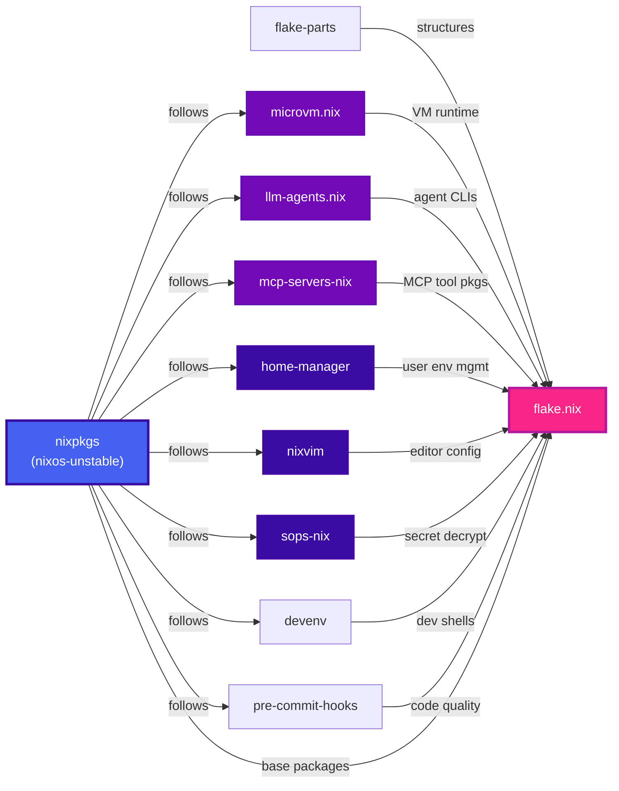
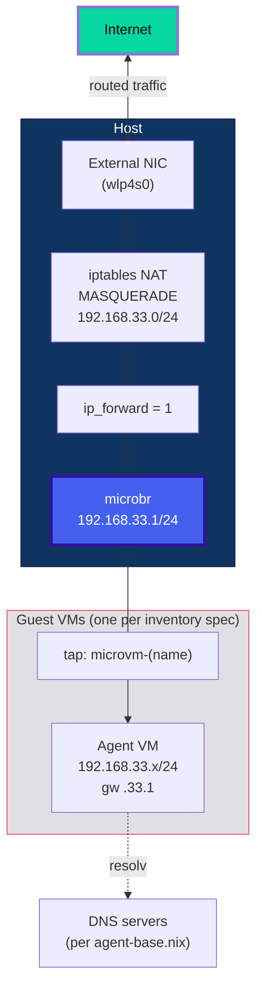
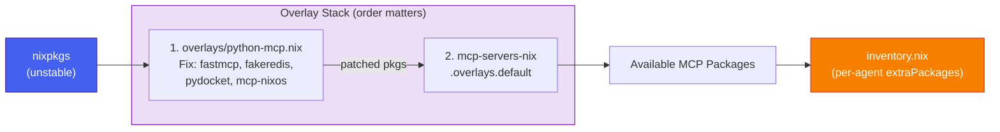
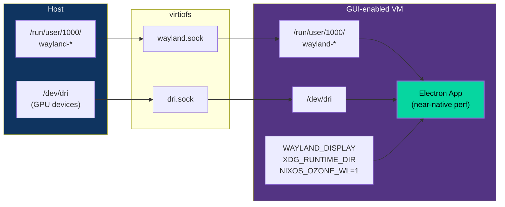
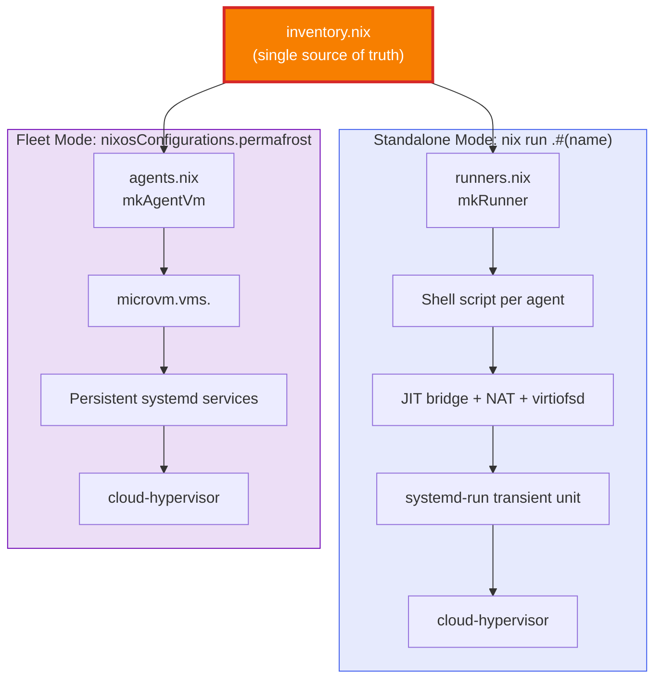

# Architecture Deep Dive

Extended diagrams covering subsystems not shown in the [main README](../README.md). Start there for the system overview, security model, lifecycle, filesystem layout, and secret injection pipeline.

---

## Flake Input Graph

All inputs pin `nixpkgs.follows` to a single `nixpkgs` instance, eliminating version drift across the entire dependency tree.

---

## Module Composition

The flake produces two output categories: **per-system packages** (the runner scripts you execute) and a **flake-wide NixOS configuration** (for deploying Permafrost as a full host).

---

## Network Architecture

Each guest gets a `tap` interface bridged to `microbr`. The host performs NAT to route guest traffic to the internet. `cloud-hypervisor` does not support user-mode SLIRP, which is why `sudo` is required — the host must create and configure TAP devices.

---

## Overlay & Package Pipeline

The Python MCP overlay fixes upstream build issues and feeds into the MCP server package set. The overlay ordering matters — `python-mcp.nix` must apply before `mcp-servers-nix.overlays.default` so the patched Python packages are visible when MCP server derivations are evaluated.

---

## GUI Passthrough

Agents with `gui = true` in their inventory spec get Wayland/GPU passthrough through the KVM boundary, enabling graphical applications at near-native performance.

---

## Dual Execution Modes

The same `inventory.nix` spec powers two different execution paths. **Standalone mode** (`nix run`) is for developers running agents on any NixOS machine. **Fleet mode** (`nixosConfigurations.permafrost`) is for deploying a dedicated multi-agent host.

