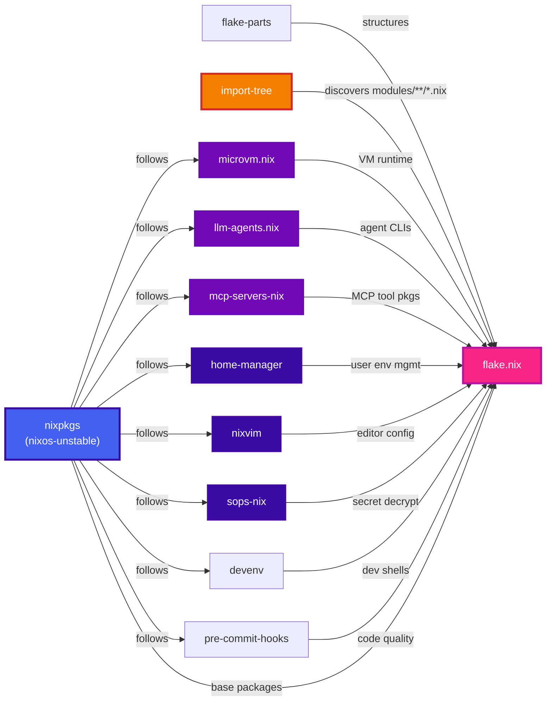
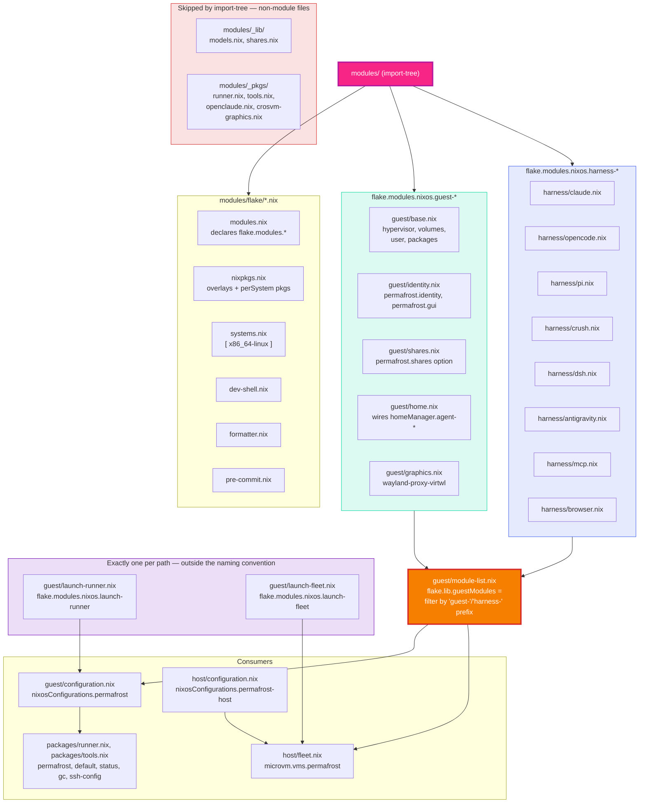
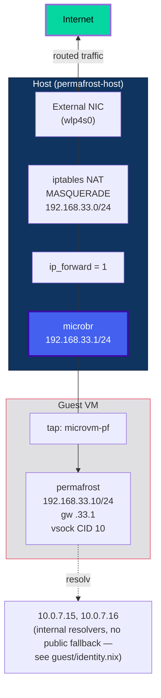
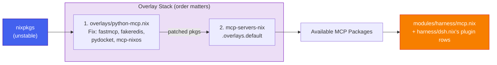
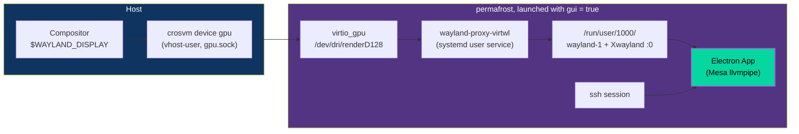
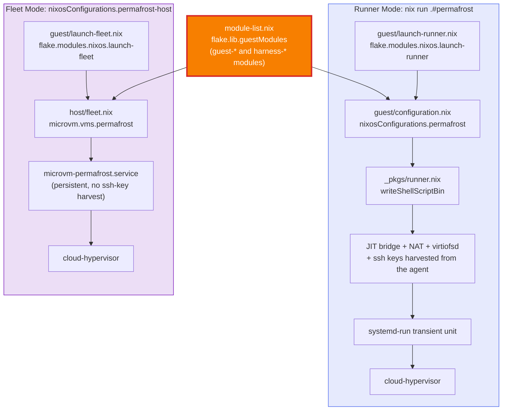

# Architecture Deep Dive

Extended diagrams covering subsystems not shown in the [main README](../README.md). Start there for the system overview, security model, lifecycle, filesystem layout, and secret injection pipeline.

---

## Flake Input Graph

All inputs pin `nixpkgs.follows` to a single `nixpkgs` instance, eliminating version drift across the entire dependency tree. `import-tree` is not a package or a build dependency — it drives `flake.nix` itself, discovering every `.nix` file under `modules/` rather than requiring each to be listed.



The whole of `flake.nix` outside `inputs` is one line:
`mkFlake { inherit inputs; } (inputs.import-tree ./modules)`. Nothing else is configured
there — every `perSystem`, every `nixosConfiguration`, every package is contributed by a
module file under `modules/`.

Two nixpkgs instances exist, and only one follows the graph above.
`nixpkgs-crosvm` is pinned to `nixos-25.05` deliberately, *not* an oversight: it exists
solely to build an older `crosvm` whose vhost-user dialect still matches the
Spectrum-patched `cloud-hypervisor` that `permafrost.gui` needs (see
`modules/guest/launch-runner.nix` and `modules/_pkgs/crosvm-graphics.nix`).

---

## Module Composition

There is no central per-agent registry file for either launch path to loop over — naming
is the registry (see below). Every `.nix` file
under `modules/` (excluding paths containing a `/_` segment — see below) is a flake-parts
module contributing to `flake.modules.<class>.<name>`, a `lazyAttrsOf (lazyAttrsOf
deferredModule)` declared once in `modules/flake/modules.nix` by importing
`flake-parts.flakeModules.modules`. Every file's contribution merges into that namespace
rather than colliding, and `_class` is stamped on each entry so a `homeManager` module
cannot be imported into a NixOS configuration by accident.



**The `_lib` / `_pkgs` convention.** `import-tree` skips any path containing a `/_` segment,
so `modules/_lib/` and `modules/_pkgs/` are where plain Nix files live — functions and
derivations imported directly by the modules that need them, rather than flake-parts
modules themselves. `modules/_lib/shares.nix` is the virtiofs tag-hashing function shared
by both launch paths and the runner script; `modules/_lib/models.nix` is the one inference
catalogue rendered into both pi's `models.json` and dsh's `llm-pi-ai` provider profile;
`modules/_pkgs/runner.nix` and `modules/_pkgs/tools.nix` build the actual packages
(`permafrost`, `status`, `gc`, `ssh-config`) consumed by `modules/packages/*.nix`.

**Naming is the registry.** `modules/guest/module-list.nix` computes
`flake.lib.guestModules` by filtering `config.flake.modules.nixos` for names starting with
`guest-` or `harness-` — there is no list to keep in sync by hand. Both launch paths
(`modules/guest/configuration.nix` for `nix run`, `modules/host/fleet.nix` for the
declarative unit) consume that one list plus their own `launch-*` module, which is what
keeps the guest identical however it is started. Adding a harness or a guest-wide concern is
adding a file; the failure mode of getting the prefix wrong is silence, not an error — a
misnamed module simply never reaches `guestModules`.

**Two nixosConfigurations, not one.** `flake.nixosConfigurations.permafrost` is the guest
itself, built from `guestModules ++ [ nixpkgs, launch-runner ]` so `nix flake check`
evaluates it and the runner script can read its merged share list back out rather than being
handed a copy. `flake.nixosConfigurations.permafrost-host` is a thin configuration — bridge,
secrets, the fleet unit — that exists to hold those concerns and give `nix flake check`
something to evaluate them against; it is not a real workstation configuration. The two
machines needed different hostnames because they share the same `microbr` bridge, hence
`permafrost-host` rather than `permafrost` for the host.

---

## Network Architecture

One guest, one address. `cloud-hypervisor` does not support user-mode SLIRP, which is why
`sudo` is required — the host must create and configure the tap device.



The host's bridge network (`modules/host/bridge.nix`) matches `matchConfig.Name =
"microvm*"` to attach a tap to `microbr`. The `microvm-` prefix is not optional:
`guest/identity.nix`'s `tapId` option and `guest/base.nix`'s `microvm.interfaces` construct
the tap as `microvm-${tapId}` for both launch paths, so a tap named anything else would be
created and then never bridged in.

---

## Guest Storage Architecture

Every writable path in the guest is a sparse disk image on the host, destroyed and recreated
on every boot. Only `/` remains RAM-backed. All four volumes are declared in one place,
`modules/guest/base.nix`.

| # | Image | Mount | Filesystem | Size | Device |
|---|---|---|---|---|---|
| 0 | `rw-store.img` | `/nix/.rw-store` | ext4 | 50 GiB | `/dev/vda` |
| 1 | `home.img` | `/home/agent` | btrfs + `compress=zstd:1` | 50 GiB | `/dev/vdb` |
| 2 | `tmp.img` | `/tmp` | ext4 | 16 GiB | `/dev/vdc` |
| 3 | `swap.img` | *(raw)* | — | 8 GiB | `/dev/vdd` |

`storeOnDisk` is `false` (the Nix store is a virtiofs share), so `withDriveLetters` applies
no offset and letters follow list order. The swap letter is **derived** via microvm.nix's own
`withDriveLetters` helper, matching on `mountPoint == null`, so it survives reordering.

### Why this shape

**Why not tmpfs.** A tmpfs `/nix/.rw-store` (`size=20G`) plus a tmpfs `/home/agent`
(`size=8192M`) cap out at 32 GiB against an 8 GiB VM's RAM, with no swap — both caps
unreachable, so `nix run` exhausts memory and fails with ENOSPC well below either declared
limit. Disk-backed volumes carry no such ceiling. The overlay *lowerdir* (host `/nix/store`
over virtiofs) never touches guest RAM either way; it is only the *upperdir* that needs to
avoid tmpfs.

**Per-volume filesystems are deliberate, not uniform.**

- `/nix/.rw-store` is **ext4** because it is an overlayfs *upperdir*, where overlay semantics
  are best-tested and btrfs CoW is a poor fit.
- `/home/agent` is **btrfs + zstd** because the guest writes into a sparse host image with no
  TRIM passthrough: deleted files never return blocks, so the image only grows during a
  session. Compression roughly halves that growth on source trees, `node_modules` and build
  output. Mounts carry `discard` so freed blocks are punched back where the hypervisor
  supports it.
- `/tmp` is **separate** so root- and agent-owned temp files do not collide on a 0700 home,
  and so a runaway build fills `/tmp` rather than the workspace.

**Swap avoids an 8 GiB per-boot write.** `createVolumesScript` has no `swap` fsType, so the
volume is `autoCreate = false` and `microvm.preStart` creates it with `truncate` and writes
the header with `mkswap` **host-side**. `swapDevices[].size` is deliberately never set: on a
non-btrfs filesystem, `nixos/modules/config/swap.nix` would `dd if=/dev/zero` the whole 8 GiB
through virtio-blk on every boot. `randomEncryption` was considered and rejected — it was
only ever a way to reach `mkswap` without that `dd`, and it drags in a `dm_crypt` dependency.

### Measured boot cost

Measured on a ZFS-backed host with the exact nixpkgs builds:

| Step | Where | Measured |
|---|---|---|
| `truncate` a sparse image (any size) | host, `microvm-run` | 5 ms, 0 blocks allocated |
| `mkfs.ext4 -q` on a 20 G sparse image | host | 27 ms, 512 B allocated |
| `mkfs.btrfs -q` on a 20 G sparse image | host | 52 ms |
| `mkswap` on a sparse 4 GiB image | host, `preStart` | 7 ms, header only |
| *(rejected)* `dd` 4 GiB swapfile | guest, per boot | 540 ms host-side, worse in-guest |

Net: roughly **50 ms** added per boot, minus one virtiofsd spawn saved by dropping the
workspace share. Images are sparse, so a booted VM occupies under 1 MiB of host disk.

### Image lifecycle

Images live at `/var/lib/permafrost/permafrost/`, keyed on the guest's `hostName`
(`permafrost.identity.name`, `modules/guest/identity.nix`).

1. **`microvm.preStart`** wipes `*.img` before `createVolumesScript` recreates them. This
   runs on both launch paths (`nix run .#permafrost` and declarative `microvm.vms`), so
   nothing an agent writes crosses a boot.
2. **`ExecStopPost`** on the systemd unit removes the whole directory whenever the unit
   stops — clean exit, crash, or `SIGKILL` — in both `run` and `start` modes. A shell trap
   could not cover the same ground: `start` mode backgrounds the unit with no foreground
   shell to catch a signal, and a trap never fires on `SIGKILL` or power loss regardless.
3. **`flock`** is taken before the `systemctl is-active` check, which is otherwise TOCTOU
   racy: two concurrent launches could both pass it and race the `preStart` wipe.
4. **`nix run .#gc`** reclaims directories whose unit is not active. `preStart` bounds a live
   guest to one stale image set, but a guest *renamed or deleted from the module tree* leaves
   a directory nothing else will ever clean — the only unbounded source of orphans, since
   there is only one guest that could leave one behind.

### Discovery

`nix run .#status` prints the guest with its IP, vsock CID, tap device and live unit state.

```
GUEST         IP               CID   TAP                STATE
permafrost    192.168.33.10    10    microvm-pf         active
```

`machinectl` is not usable for this. microvm.nix's `lib/runner.nix` notes that NSS resolution
works for containers but not VMs, because machined's `GetAddresses` needs container namespaces
to enumerate IPs — it would list the VM without its address. The address is static in
`permafrost.identity`, so the row is read straight from the guest's own configuration.

---

## Overlay & Package Pipeline

The Python MCP overlay fixes upstream build issues and feeds into the MCP server package set. The overlay ordering matters — `overlays/python-mcp.nix` must apply before `mcp-servers-nix.overlays.default` so the patched Python packages are visible when MCP server derivations are evaluated. Both are applied once, in `modules/flake/nixpkgs.nix`, to the one `pkgs` instance every `perSystem` and the guest itself share.



A third overlay pair, `overlays/cloud-hypervisor-graphics.nix`, is applied conditionally —
only when `permafrost.gui = true` — from `modules/guest/launch-runner.nix`, since it pins
`cloud-hypervisor` itself to a source build and would otherwise force every launch to build
it from scratch instead of taking nixpkgs's cached binary.

---

## GUI Passthrough

The default transport is **waypipe over SSH**, which involves none of the machinery
below: `waypipe --no-gpu ssh -t agent@192.168.33.10 bash -l` proxies the Wayland protocol over the SSH
connection, needing only the binary on both ends. It is installed on the host
(`modules/host/bridge.nix`) and on the guest (`modules/guest/base.nix`), unconditionally.

What is *not* possible is sharing the host's Wayland socket over virtiofs: virtiofs
exports an `AF_UNIX` socket as an inode but has no socket proxying, so a guest
`connect()` on it can never reach the host listener.

The second path, `permafrost.gui = true` in `modules/guest/identity.nix` (off by default,
see `docs/usage.md` for why), uses virtio-gpu. microvm.nix's cloud-hypervisor
`preStart` runs `crosvm device gpu` on the
host — itself an ordinary Wayland client of the invoking session's compositor —
and hands the VM a vhost-user GPU device. In the guest, `wayland-proxy-virtwl`
(`modules/guest/graphics.nix`) runs as a systemd **user** service, allocating buffers from `/dev/dri/renderD128`
(provided by `virtio_gpu`, so no `/dev/dri` passthrough is needed) and serving
`/run/user/1000/wayland-1`. Being a user service, it is reachable from any later
session, which is what makes GUI-over-SSH work.

This requires a live compositor in the launching session, so GUI is only reachable through
the JIT runner (`nix run .#permafrost`), never through the declarative
`microvm.vms` path — `modules/guest/launch-fleet.nix` deliberately ignores
`permafrost.gui` because a system unit has no compositor to attach to. Rendering is Mesa llvmpipe; no hardware GPU is exposed.



The diagram above is the opt-in `gui = true` path. The default is simpler: waypipe
carries the Wayland protocol over the SSH connection itself, so no virtio-gpu,
crosvm, or patched hypervisor is involved on either side.

---

## Dual Execution Modes

The same set of `flake.lib.guestModules` powers two different execution paths, so a guest is
identical however it was started — only the launch module and the shares it can populate
differ. **Runner mode** (`nix run .#permafrost`) is for a developer running the guest on any
NixOS machine. **Fleet mode** (`nixosConfigurations.permafrost-host`, `microvm.vms.permafrost`)
is for deploying a dedicated host that starts the guest as a persistent systemd service.



The two paths differ in exactly what each `launch-*` module contributes: `launch-runner.nix`
spins up a virtiofsd per share against sockets in a systemd `RuntimeDirectory` and,
runner-only, harvests ssh public keys from the launching user's agent into a share of their
own; `launch-fleet.nix` runs virtiofsd on the host itself and shares real host paths, with no
ssh-key share at all — a fleet-started guest is reachable only over the serial console unless
something else puts a key in `~agent/.ssh/authorized_keys`. `permafrost.gui` is silently
ignored by the fleet path for the reason given under GUI Passthrough above. The tap naming
described under Network Architecture applies to both paths identically, since both build
their tap from the same `permafrost.identity.tapId` option.
