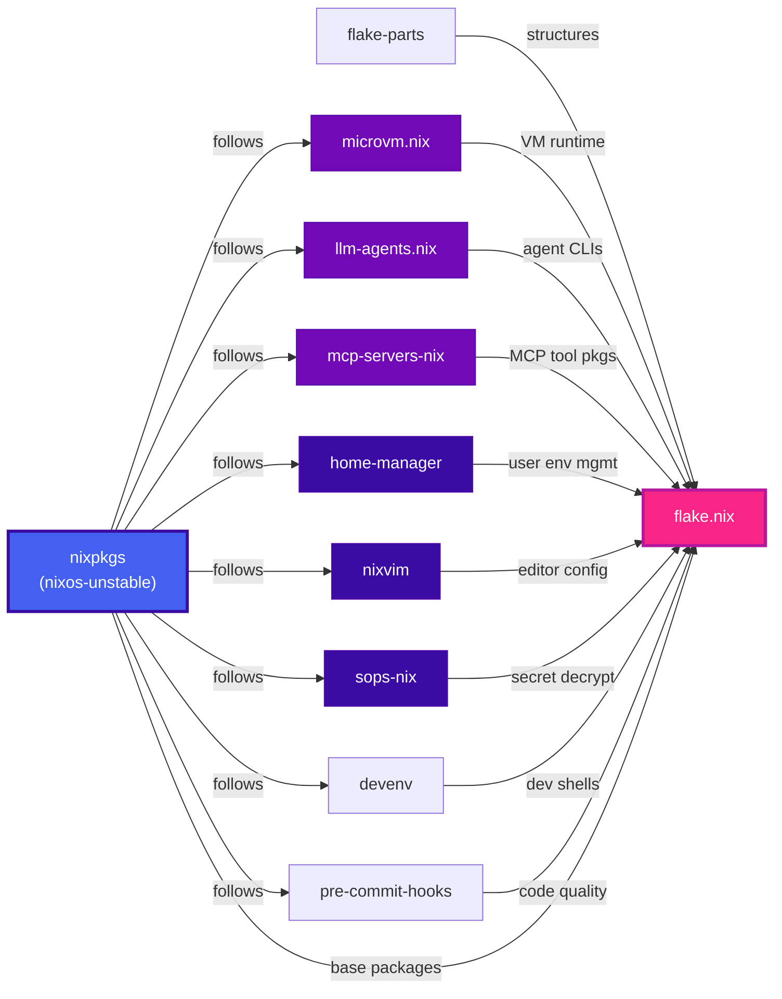
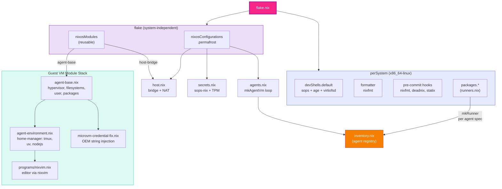
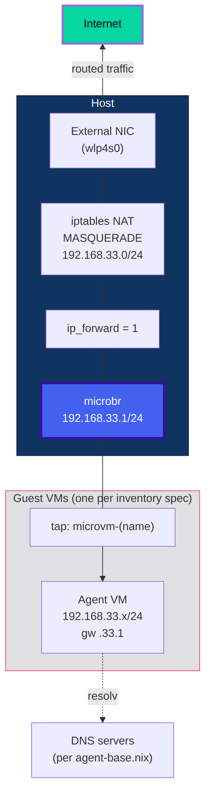
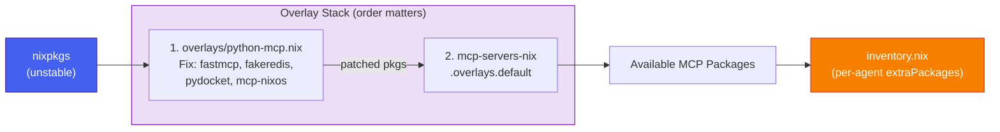
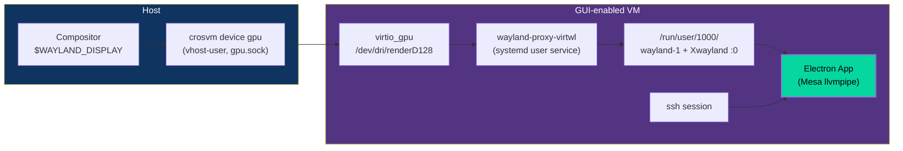
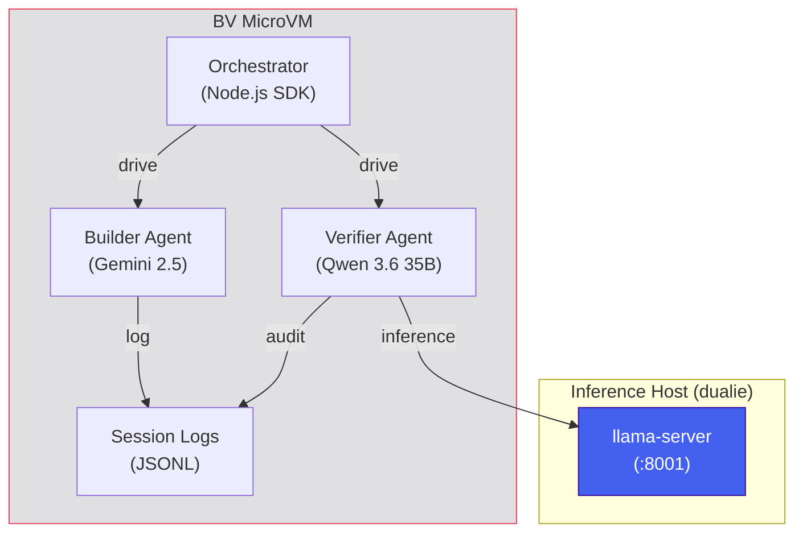
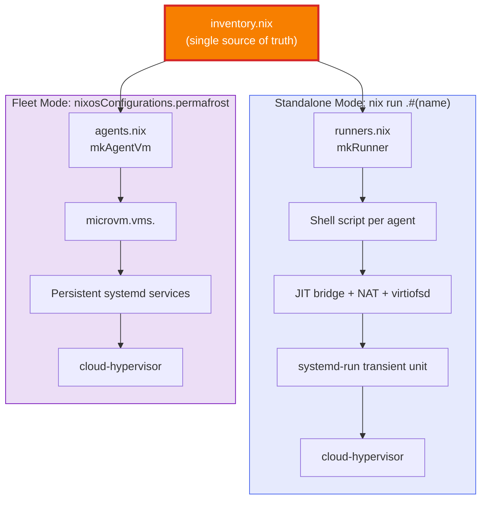

# Architecture Deep Dive

Extended diagrams covering subsystems not shown in the [main README](../README.md). Start there for the system overview, security model, lifecycle, filesystem layout, and secret injection pipeline.

---

## Flake Input Graph

All inputs pin `nixpkgs.follows` to a single `nixpkgs` instance, eliminating version drift across the entire dependency tree.



---

## Module Composition

The flake produces two output categories: **per-system packages** (the runner scripts you execute) and a **flake-wide NixOS configuration** (for deploying Permafrost as a full host).



---

## Network Architecture

Each guest gets a `tap` interface bridged to `microbr`. The host performs NAT to route guest traffic to the internet. `cloud-hypervisor` does not support user-mode SLIRP, which is why `sudo` is required — the host must create and configure TAP devices.



---

## Guest Storage Architecture

Every writable path in the guest is a sparse disk image on the host, destroyed and recreated
on every boot. Only `/` remains RAM-backed. All four volumes are declared in one place,
`modules/agent-base.nix`.

| # | Image | Mount | Filesystem | Size | Device |
|---|---|---|---|---|---|
| 0 | `rw-store.img` | `/nix/.rw-store` | ext4 | 50 GiB | `/dev/vda` |
| 1 | `home.img` | `/home/agent` | btrfs + `compress=zstd:1` | 50 GiB | `/dev/vdb` |
| 2 | `tmp.img` | `/tmp` | ext4 | 16 GiB | `/dev/vdc` |
| 3 | `swap.img` | *(raw)* | — | 8 GiB | `/dev/vdd` |

`storeOnDisk` is `false` (the Nix store is a virtiofs share), so `withDriveLetters` applies
no offset and letters follow list order. The swap letter is **derived** via microvm.nix's own
`withDriveLetters` helper, matching on `mountPoint == null`, so it survives reordering.

### Why this shape

**The tmpfs bug it replaces.** `/nix/.rw-store` and `/home/agent` were previously tmpfs with
`size=20G` and `size=8192M` on an 8 GiB VM — 32 GiB of caps against 8 GiB of RAM, with no
swap. Both caps were unreachable, and `nix run` exhausted memory and failed with ENOSPC well
below any declared limit. The overlay *lowerdir* (host `/nix/store` over virtiofs) was always
fine; only the upperdir was misplaced.

**Per-volume filesystems are deliberate, not uniform.**

- `/nix/.rw-store` is **ext4** because it is an overlayfs *upperdir*, where overlay semantics
  are best-tested and btrfs CoW is a poor fit.
- `/home/agent` is **btrfs + zstd** because the guest writes into a sparse host image with no
  TRIM passthrough: deleted files never return blocks, so the image only grows during a
  session. Compression roughly halves that growth on source trees, `node_modules` and build
  output. Mounts carry `discard` so freed blocks are punched back where the hypervisor
  supports it.
- `/tmp` is **separate** so root- and agent-owned temp files do not collide on a 0700 home,
  and so a runaway build fills `/tmp` rather than the workspace.

**Swap avoids an 8 GiB per-boot write.** `createVolumesScript` has no `swap` fsType, so the
volume is `autoCreate = false` and `microvm.preStart` creates it with `truncate` and writes
the header with `mkswap` **host-side**. `swapDevices[].size` is deliberately never set: on a
non-btrfs filesystem, `nixos/modules/config/swap.nix` would `dd if=/dev/zero` the whole 8 GiB
through virtio-blk on every boot. `randomEncryption` was considered and rejected — it was
only ever a way to reach `mkswap` without that `dd`, and it drags in a `dm_crypt` dependency.

### Measured boot cost

Measured on a ZFS-backed host with the exact nixpkgs builds:

| Step | Where | Measured |
|---|---|---|
| `truncate` a sparse image (any size) | host, `microvm-run` | 5 ms, 0 blocks allocated |
| `mkfs.ext4 -q` on a 20 G sparse image | host | 27 ms, 512 B allocated |
| `mkfs.btrfs -q` on a 20 G sparse image | host | 52 ms |
| `mkswap` on a sparse 4 GiB image | host, `preStart` | 7 ms, header only |
| *(rejected)* `dd` 4 GiB swapfile | guest, per boot | 540 ms host-side, worse in-guest |

Net: roughly **50 ms** added per boot, minus one virtiofsd spawn saved by dropping the
workspace share. Images are sparse, so a booted VM occupies under 1 MiB of host disk.

### Image lifecycle

Images live at `/var/lib/permafrost/<agent>/`, keyed on the guest's `hostName`, which
`inventory.nix` keeps unique — so different agents never collide.

1. **`microvm.preStart`** wipes `*.img` before `createVolumesScript` recreates them. This
   runs on both launch paths (`nix run .#<agent>` and declarative `microvm.vms`), so nothing
   an agent writes crosses a boot.
2. **`ExecStopPost`** on the systemd unit removes the whole directory whenever the unit
   stops — clean exit, crash, or `SIGKILL`. It replaced a shell `cleanup()` trap, which only
   fired in `run` mode and never on kill or power loss.
3. **`flock`** is taken before the `systemctl is-active` check, which is otherwise TOCTOU
   racy: two concurrent launches could both pass it and race the `preStart` wipe.
4. **`nix run .#gc`** reclaims directories whose unit is not active. `preStart` bounds live
   agents to one stale image set each, but an agent *deleted from `inventory.nix`* leaves a
   directory nothing else will ever clean — the only unbounded source of orphans.

### Discovery

`nix run .#status` prints every agent with its IP, vsock CID, tap device and live unit state.

```
AGENT         IP               CID   TAP                STATE
claude        192.168.33.10    10    microvm-claude     active
bv            192.168.33.16    16    microvm-bv         inactive
```

`machinectl` is not usable for this. microvm.nix's `lib/runner.nix` notes that NSS resolution
works for containers but not VMs, because machined's `GetAddresses` needs container namespaces
to enumerate IPs — it would list the VMs without their addresses. Addresses are static in
`inventory.nix`, so the table is generated from there and joined with systemd unit state.

---

## Overlay & Package Pipeline

The Python MCP overlay fixes upstream build issues and feeds into the MCP server package set. The overlay ordering matters — `python-mcp.nix` must apply before `mcp-servers-nix.overlays.default` so the patched Python packages are visible when MCP server derivations are evaluated.



---

## GUI Passthrough

The default transport is **waypipe over SSH**, which involves none of the machinery
below: `waypipe --no-gpu ssh -t agent@<ip> bash -l` proxies the Wayland protocol over the SSH
connection, needing only the binary on both ends. It is installed on the host and
on every guest.

What is *not* possible is sharing the host's Wayland socket over virtiofs: virtiofs
exports an `AF_UNIX` socket as an inode but has no socket proxying, so a guest
`connect()` on it can never reach the host listener.

The second path, `gui = true` in `modules/inventory.nix` (off by default, see
`docs/usage.md` for why), uses virtio-gpu. microvm.nix's cloud-hypervisor
`preStart` runs `crosvm device gpu` on the
host — itself an ordinary Wayland client of the invoking session's compositor —
and hands the VM a vhost-user GPU device. In the guest, `wayland-proxy-virtwl`
runs as a systemd **user** service, allocating buffers from `/dev/dri/renderD128`
(provided by `virtio_gpu`, so no `/dev/dri` passthrough is needed) and serving
`/run/user/1000/wayland-1`. Being a user service, it is reachable from any later
session, which is what makes GUI-over-SSH work.

This requires a live compositor in the launching session, so GUI guests only work
through the JIT runners (`nix run .#claude`), never through the declarative
`microvm.vms` path. Rendering is Mesa llvmpipe; no hardware GPU is exposed.



The diagram above is the opt-in `gui = true` path. The default is simpler: waypipe
carries the Wayland protocol over the SSH connection itself, so no virtio-gpu,
crosvm, or patched hypervisor is involved on either side.

---

---

## Builder-Verifier Architecture

The Builder-Verifier (BV) system uses a dual-agent model to automate the "Trust but Verify" workflow. It separates the creative task of code generation from the analytical task of auditing.

### System Components



### The Verification Loop

The orchestrator enforces a strict state machine to ensure quality and security:

1.  **Prime:** Builder loads project context using the `prime` skill.
2.  **Build:** Builder implements the task and provides a "Completion Summary" with atomic claims.
3.  **Lint:** Orchestrator runs deterministic checks (`tsc`, `eslint`) in the workspace.
4.  **Verify:** Verifier reads the full Builder session log and validates each atomic claim against tool outputs.
5.  **Feedback:** If verification or linting fails, the Orchestrator provides feedback to the Builder for a retry (max 2 rounds).

### Key Architectural Patterns

- **Declarative Orchestration:** The entire orchestrator, agent instructions, and security extensions are managed declaratively via Nix. This ensures that the agent's "personality" and reasoning logic are versioned alongside the code.
- **Bash Lockdown:** The builder operates under a strict command allowlist (`bash-lockdown.ts`) to prevent unauthorized system modifications.
- **Read-Only Verification:** The verifier is architecturally restricted from modifying files or executing bash, ensuring its audit is strictly analytical.
- **Local Inference:** The Verifier uses a local llama.cpp endpoint (`petunia.home.lan:8001`) for data residency and specialized reasoning performance.
- **Completion Summaries:** The system relies on "Atomic Claims" — verifiable statements made by the builder that the verifier must prove or disprove based on session evidence.

---

## Dual Execution Modes

The same `inventory.nix` spec powers two different execution paths. **Standalone mode** (`nix run`) is for developers running agents on any NixOS machine. **Fleet mode** (`nixosConfigurations.permafrost`) is for deploying a dedicated multi-agent host.


